### 自用博客系统
ysx-blog由thymeleaf + Mybatis-plus + SpringBoot等技术实现的Java系统，分为前台展示和后台管理界面。页面美观、功能齐全
部署简单及非常完善的代码以及相关说明均可在swagger中进行查看。引用了开源的数据库数据对数据进行填充。

### 效果预览
#### 后端管理页面展示
##### 1、登录界面(默认账户:ysx, 默认密码:123456)
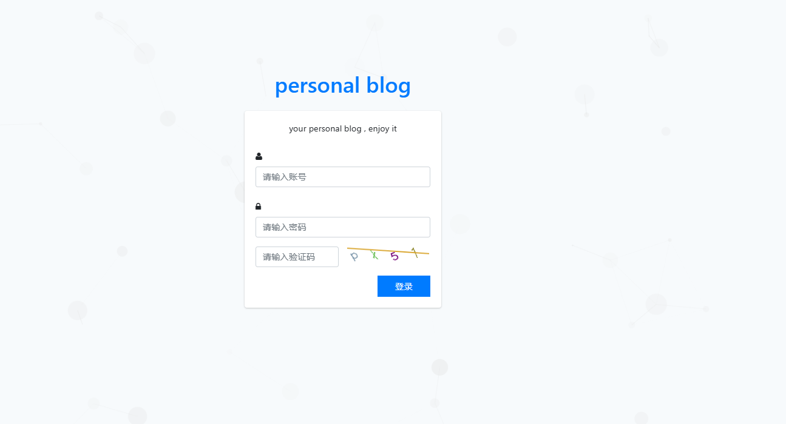
##### 2、管理页面主页
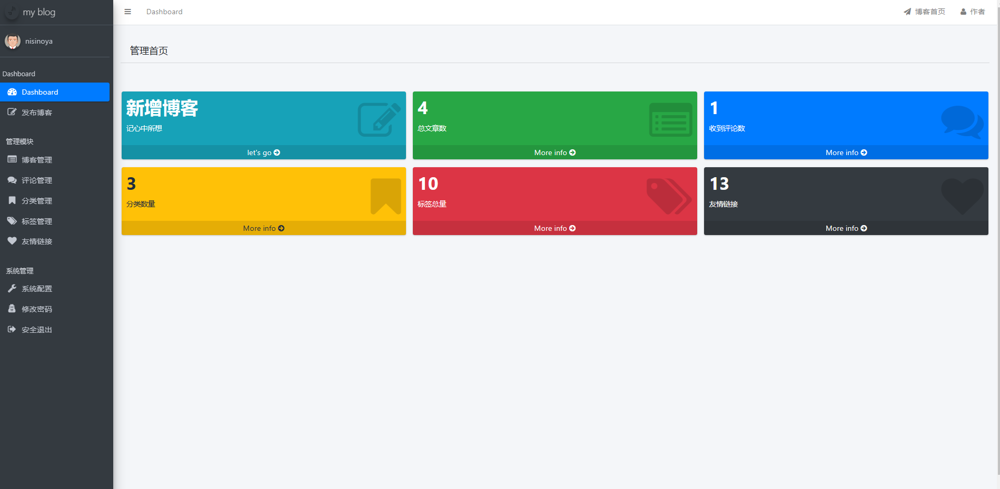
##### 3、博客发布界面
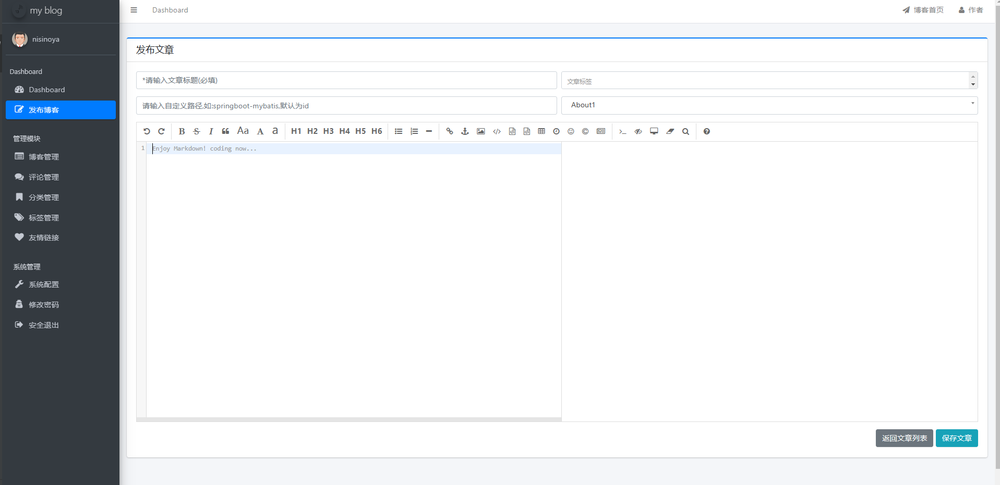
##### 4、博客管理页面
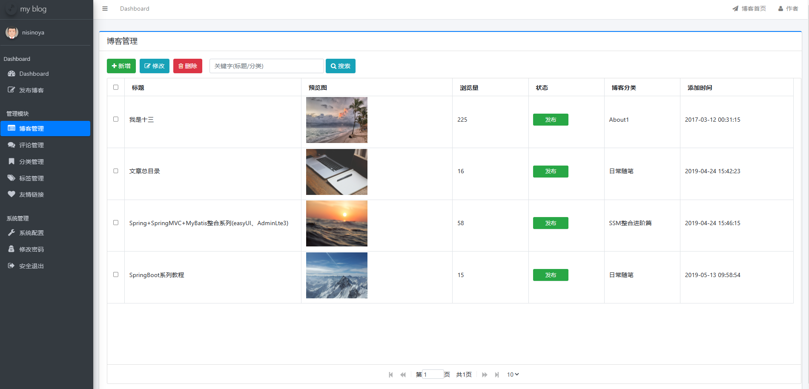
##### 5、评论管理
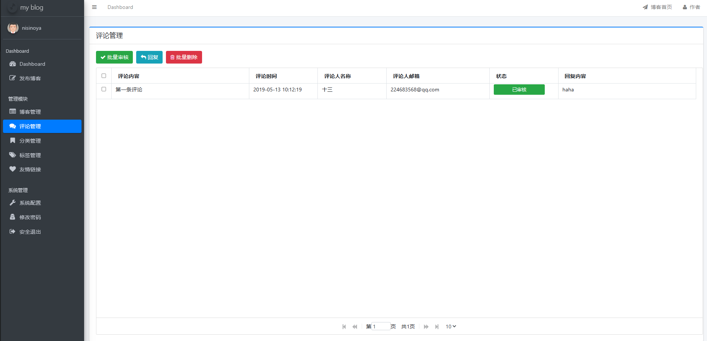
##### 6、分类管理
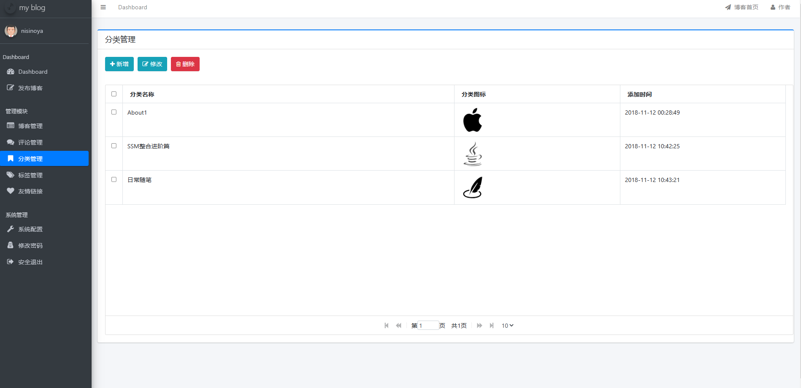
##### 7、标签管理
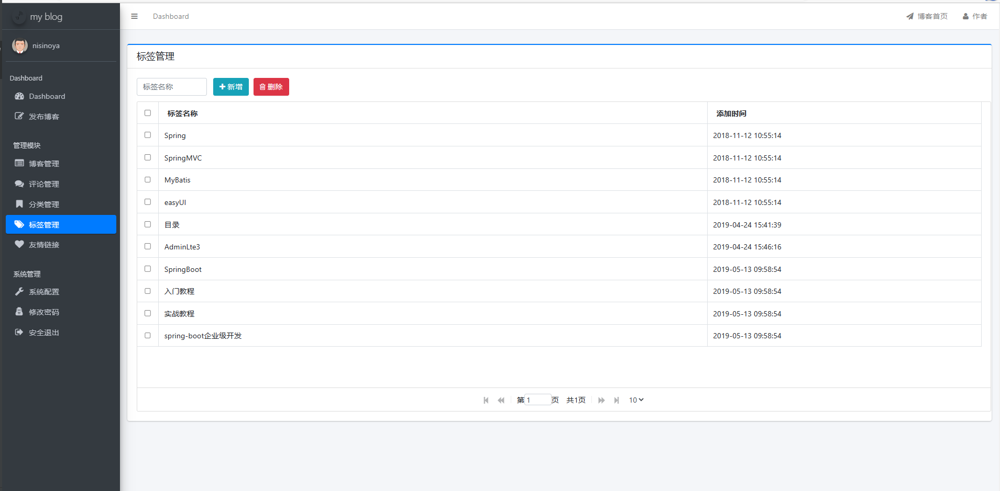
##### 8、友链管理
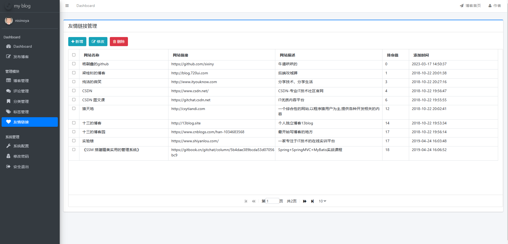
##### 9、系统配置管理
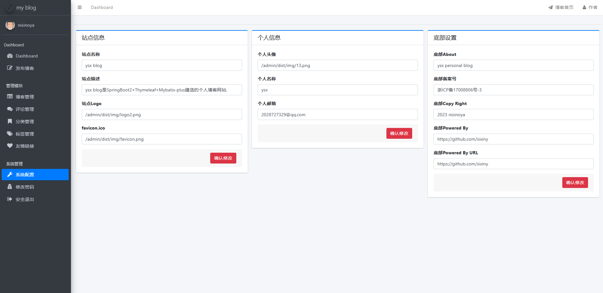
##### 10、密码昵称修改管理
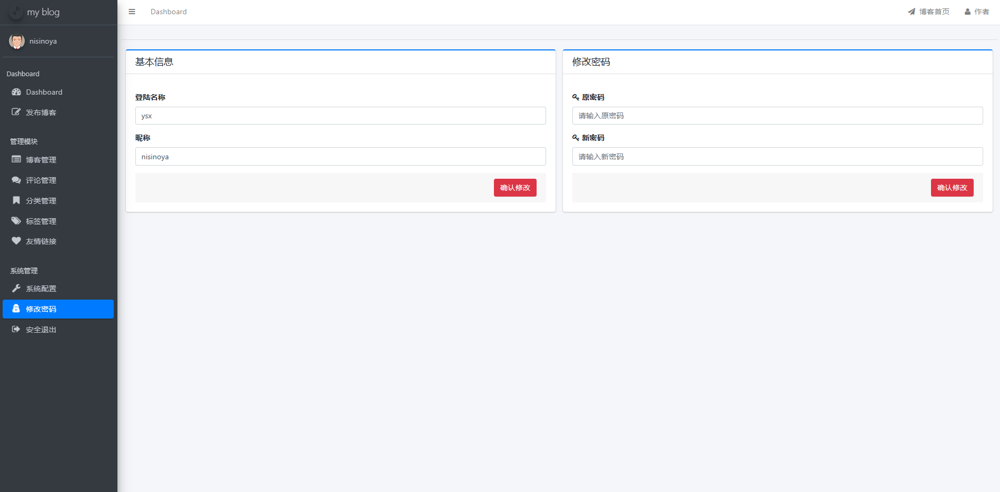
##### 11、首页展示
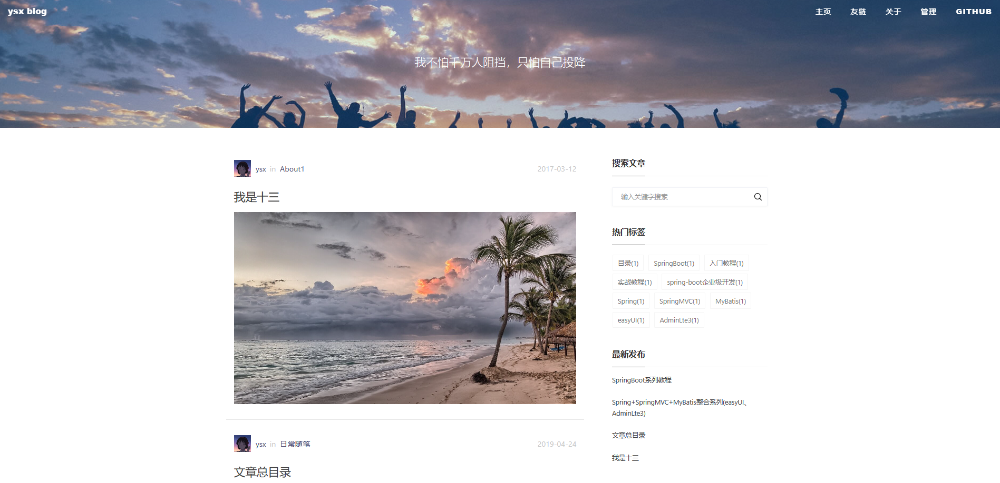
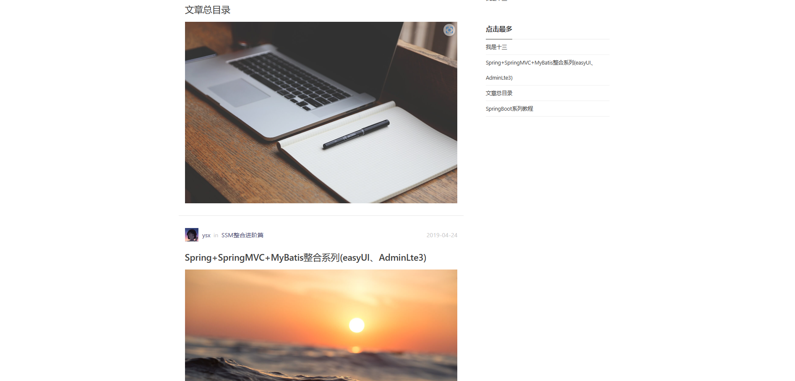

#### Swagger接口实现说明
整合Swagger2， 访问接口: (自定义地址)/swagger-ui.html
##### 1、主要控制器
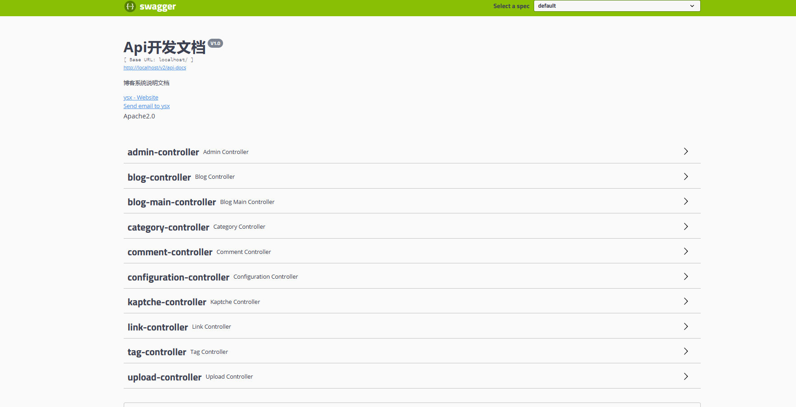
##### 2、部分controller说明展示
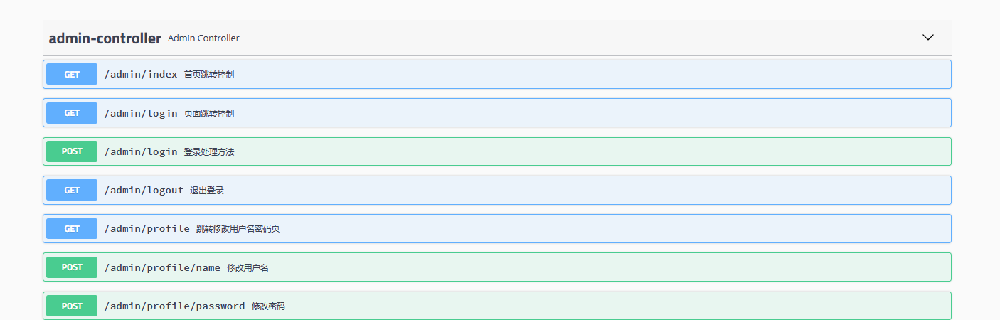
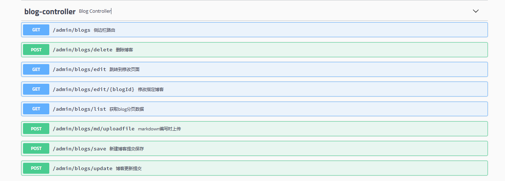
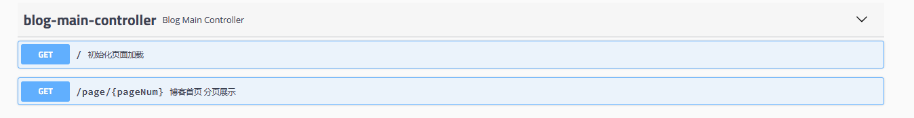

##### 说明
博客功能持续完善ing
如有疑问或指点，可以联系yangsixin1999@163.com
